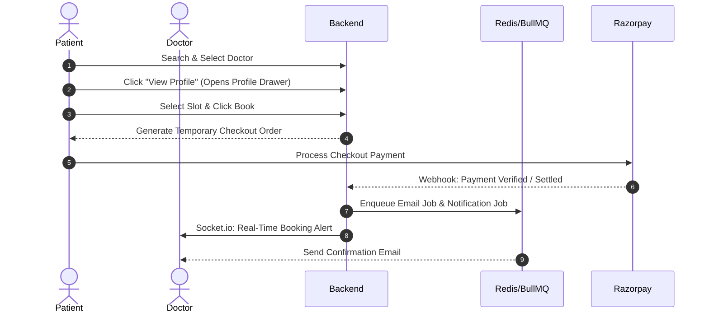

# Pulse360 | Modern Doctor Consultation & Healthcare Platform
Pulse360 Banner

Pulse360 is a production-grade, high-fidelity telemedicine and digital healthcare consultation platform. Built with a focus on premium aesthetics and scalable architecture, it provides a seamless appointment booking experience for patients, advanced slot scheduling tools for doctors, and a powerful dashboard console for administrators.

---

## ✨ Features & Business Processes

### 🛍️ Patient Experience (Storefront & Portal)
*   **Authentication & Webhook Sync**: Powered by **Clerk Auth**, featuring session management. System accounts (Patient, Doctor, Admin) are synced in real-time to MongoDB via Webhook event endpoints.
*   **3D Interactive Elements**: Highlights the brand experience using **Three.js**, **React Three Fiber (R3F)**, and **Drei** (e.g., scroll-parallax landing hero space background and interactive heartbeat loaders).
*   **Dynamic Doctor discovery**: Discovery engine allowing patients to find practitioners by specialty, fees, ratings, or location.
*   **Checkout & Profile Drawer**: Slide-over profile preview pane displaying clinical qualifications, ratings, experience lists, and council registry status before confirming appointment payments.
*   **Olfactory Wallet**: Multi-functional digital wallet enabling:
    *   Direct checkout integrations.
    *   Secure top-ups using **Razorpay**.
    *   Automated wallet refunds upon appointment cancellation.
*   **Consultation Hub**: Real-time communication portal containing:
    *   **Chat Messaging**: Private channels with typing indicators, unread message badges, and delivery states managed by **Socket.io**.
    *   **WebRTC Video Consultations**: Real-time video/audio connections.
    *   **AI Background Blur**: In-browser background blur filter using **Google MediaPipe Selfie Segmentation**.

### 🩺 Doctor Workspace Console
*   **Weekly Scheduling Editor**: Granular controls to define consultation hours, block availability slots, and customize fees for Online Video or In-person Clinic consultations.
*   **Earnings Intelligence**: Detailed finance charts built with **Recharts**, highlighting monthly payouts, daily consult revenues, and YTD earnings.
*   **Clinical Records Manager**: Interface to log patient consultation reports, create prescription sheets, and review medical history records.

### 🛡️ Administrative Ecosystem
*   **Executive Statistics**: Unified dashboard showing platform metrics (Verified consultants, registration request pipelines, total commissions).
*   **Credential Verification System**: Registry verification queue to check state council license uploads and approve pending doctor applications.
*   **Account CRM**: Searchable database to monitor user states (active, blocked) and view logs recording account restrictions.

---

## 🛠️ Technology Stack & Library Ecosystem

### 💻 Frontend (Client Application)
*   **Core Framework**: **React 19** + **Vite** (Next-gen bundling with HMR).
*   **Styling & Design Tokens**: **TailwindCSS v4** (utilizing next-gen `@tailwindcss/vite` compiling pipeline).
*   **Animations**: **Framer Motion**, **GSAP**, and **Popmotion** for premium micro-interactions.
*   **Data Fetching & State**: **Axios** clients and custom caching hooks.
*   **Real-time Communication**: **Socket.io-client** for real-time WebSocket messaging and video signaling.
*   **3D Engine**: **Three.js**, **@react-three/fiber**, and **@react-three/drei** for interactive 3D assets.
*   **Media Processing**: **@mediapipe/selfie_segmentation** for virtual video background filters.
*   **Accessible Components**: **Radix UI** primitives and **lucide-react** / **@iconify/react** icon assets.
*   **Helper Libraries**: **date-fns** (date manipulation) and **react-day-picker** (calendar widget selection).

### ⚙️ Backend (Server Application)
*   **Core Runtime**: **Node.js** using ES Modules (`"type": "module"`), built on **Express.js v5**.
*   **Database ORM**: **MongoDB** with **Mongoose ODM** schema design.
*   **Task Queues & Background Workers**: **BullMQ** backed by **Redis** (ioredis client) for background transactional processing.
*   **Security & Encryption**: **bcryptjs** (password hashing) and **jsonwebtoken (JWT)** (access token validation).
*   **Media & File Processing**: **Multer** and **Cloudinary SDK** for secure profile image and registry document storage.
*   **Automated Scheduling**: **Node-Cron** for automated appointment checks, unpaid booking expiries, and daily summaries.
*   **Transactional Messaging**: **Nodemailer** for OTP, appointment confirmations, and email reminders.
*   **PDF Report Generator**: **Puppeteer** for automated server-side PDF exports (medical reports and invoices).
*   **Third-Party APIs**: **Razorpay Node SDK** for payments, and **Svix** for Clerk webhook authentication.

---

## 🔄 App Workflows & Processes



### 1. Booking Checkout & Payment Lifecycle
1.  **Selection**: The patient discovers a doctor and selects a consult format (online/offline) and time slot.
2.  **Locking**: The backend locks the slot temporarily.
3.  **Payment**: Patient pays using Razorpay or Wallet.
    *   If payment is successful, the appointment status shifts to `confirmed` or `ongoing`.
    *   If unpaid, **Node-Cron** triggers an automatic sweep to unlock the slot after 15 minutes.

### 2. Video Consulting & Blur Pipeline
1.  **Call Initiation**: The doctor clicks "Start Video Call", emitting a signaling event over Socket.io.
2.  **Room Setup**: The patient receives the ring signal and joins the WebRTC peer-to-peer connection.
3.  **Background Blurring Filter**:
    *   The patient's local camera stream is intercepted.
    *   **MediaPipe Selfie Segmentation** identifies the user's silhouette.
    *   A canvas overlays the processed frame with a blurred background, sending the sanitized canvas track to the remote doctor.

---

## 🚀 Getting Started

### Prerequisites
*   Node.js (v18.x or higher)
*   MongoDB (Local instance or Atlas connection URI)
*   Redis Server (Required for BullMQ task worker execution)

### Installation
1.  **Clone the repository**:
    ```bash
    git clone https://github.com/yourusername/project-pulse.git
    cd project-pulse
    ```

2.  **Install dependencies**:
    *   **Backend dependencies**:
        ```bash
        cd backend
        npm install
        ```
    *   **Frontend dependencies**:
        ```bash
        cd ../frontend
        npm install
        ```

3.  **Environment Configuration**: Create `.env` files in both directories.

    *   **Backend (`backend/.env`)**:
        ```ini
        PORT=5000
        DB_URL=mongodb://localhost:27017/pulse-db
        JWT_SECRET=your_jwt_signing_secret
        CLERK_SECRET_KEY=sk_test_your_clerk_secret
        CLERK_WEBHOOK_SECRET=whsec_your_clerk_webhook
        RAZORPAY_KEY_ID=rzp_test_your_key_id
        RAZORPAY_KEY_SECRET=your_razorpay_secret
        CLOUDINARY_CLOUD_NAME=your_cloudinary_cloud
        CLOUDINARY_API_KEY=your_cloudinary_api_key
        CLOUDINARY_API_SECRET=your_cloudinary_secret
        GMAIL_USER=your_email@gmail.com
        GMAIL_PASS=your_gmail_app_password
        ```

    *   **Frontend (`frontend/.env`)**:
        ```ini
        VITE_API_BASE_URL=http://localhost:5000
        VITE_CLERK_PUBLISHABLE_KEY=pk_test_your_clerk_key
        VITE_RAZORPAY_KEY_ID=rzp_test_your_key_id
        ```

4.  **Run the application**:
    *   **Start Backend**:
        ```bash
        cd backend
        npm run dev
        ```
    *   **Start Frontend**:
        ```bash
        cd ../frontend
        npm run dev
        ```

---

## 🎨 Design Principles
*   **Aesthetic First**: Layout interfaces use modern typography, harmonious colors, and subtle micro-animations (Framer Motion) to look premium.
*   **Performance Focused**: Light skeleton loaders replace blank white flashes during loading states to maintain visual continuity.
*   **Responsive Flow**: Grid systems scale fluidly from compact mobile viewports to ultra-wide desktop dashboards.

---

## 📜 License
This project is licensed under the MIT License - see the LICENSE file for details.

Designed with elegance. Engineered for performance.
Pulse360 | The Essence of Elegance
